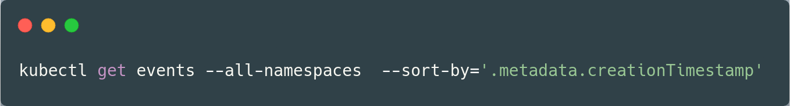
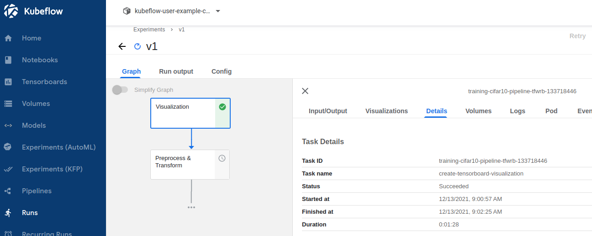

# EMLO Session 7

The objective of this class is to start/install and run Kubeflow and train a Pytorch Resnet18 model on the CIFAR dataset.

# From Pipeline to Manifests

Last week, we only deployed Kubeflow pipeline. This time, we install the complete Kubeflow architecture (including pipelines).

# Installing Kubeflow Manifests

## Starting minikube

I used all 4 cpus and around 6 GB of memory. Note that here we have to specify the physical CPUs (max. 4) and not the logical CPUs (max. 8).

  

We have to install `kustomize`. This is the tool that reads all scripts and starts all pods/deployments/services needed for Kubernetes.

 

Then, we clone the repo and use `kustomize` to run all scripts.

 

We have to setup the secret (user and password) for minio. The default can be seen at [minio's website](from https://docs.min.io/docs/minio-kms-quickstart-guide.html) along with further instructions to change them. After adding them in the yaml files, we browse to the pipline's cloned repo and apply the changes.

  
 
Once all pods are up and running (after about 45 min and 6+ GB of downloading), we have to use port-forwarding so we can start Kubeflow website with the following command

  

Note that for debugging purposes, we can use the following command

  

# Running Kubeflow

After port-forwarding, we can open the website at  http://localhost:8080/. The default username and password is user@example.com and 12341234 respectively, which is given at [Kubeflow Manifests' website](https://github.com/kubeflow/manifests)

## Create Pipeline

First, we create the pipeline by uploading the file from last week.

## Create Experiment

We also have to create an experiment for our run

## Create Run

Then we create a run

We also have to speicfy the cookie for our run. This can be done by installing the extension [EditThisCookie](https://chrome.google.com/webstore/detail/editthiscookie/fngmhnnpilhplaeedifhccceomclgfbg/related?hl=en)

## Running Pipeline

After we start our run, we can see that new containers will be created

Once the training part completes, we can see a green check mark. Also, the status will be marked as 'Succeeded'.

Other parts will follow.

Unfortunately, the deployer part still doesn't work. However, this time the error is different.

It says insufficient CPU and memory. The pods therefore don't get created.

Not much can be done here!